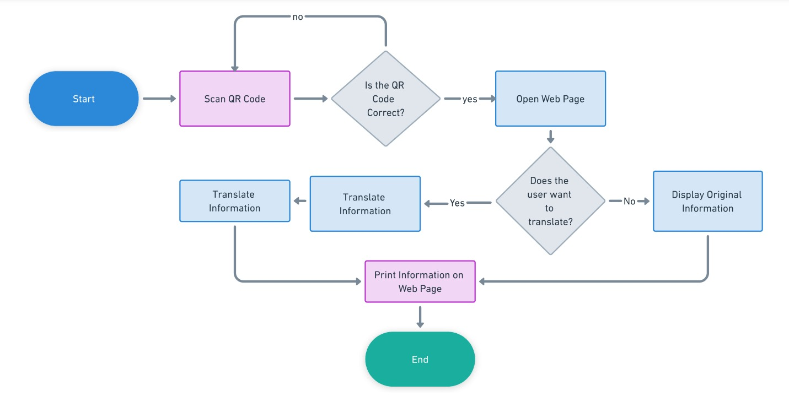
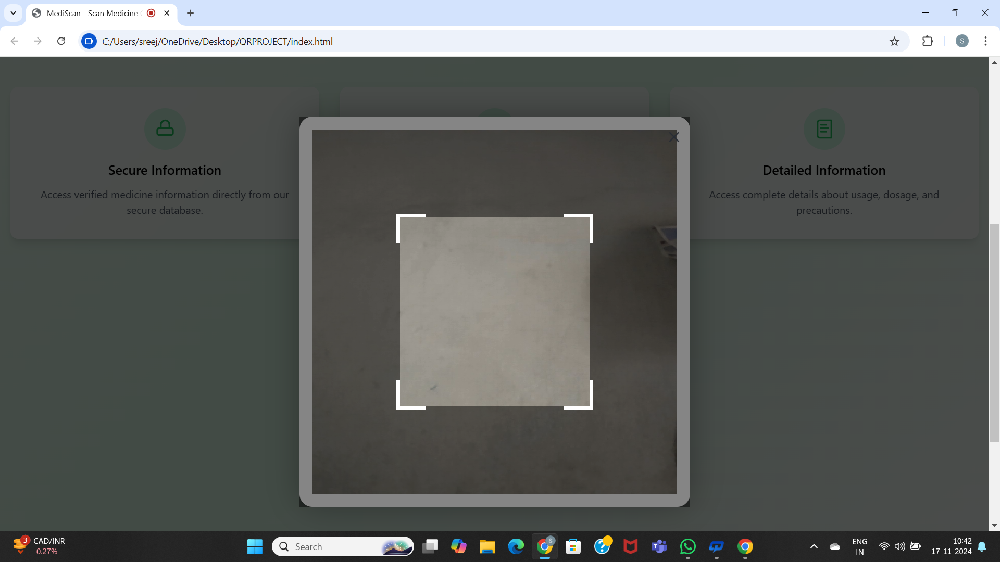
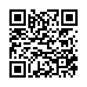
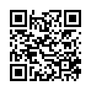
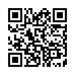

# <h1>MediScan</h1>
Accessing information of medicines via QR Code

<h2>Problem Statement</h2>
In today's fast-paced world, patients often struggle to access critical information on their tablet sheets, such as manufacturing details, side effects, and instructions for use. Traditional medicine tablet sheets are often cluttered and have limited space on tablet sheet, which results in condensed, small-font text that may be difficult to read, especially for individuals with visual impairments. The information is only provided in a single language, making it difficult for non-native speakers  to understand.
 

<h2>Scope</h2>
   This project aims to solve these challenges by embedding QR codes on each tablet byte in a medicine sheet, providing instant, multilingual access to clear and comprehensive medication information in a website.

<h2>Application Areas</h2>

<ul>
  <li>
    <h4>Pharmaceutical Packaging:</h4>
    QR codes on packaging provide detailed medicine information such as ingredients, usage instructions, and warnings.
  </li>
  <li>
    <h4>Patient Empowerment:</h4>
    Enables patients to understand medication details in their preferred language, reducing the risk of misuse.
  </li>
  <li>
    <h4>Healthcare Education:</h4>
    Assists medical students and professionals by providing detailed insights into tablet compositions, usage, and precautions.
  </li>
  <li>
    <h4>Pharmacy Support:</h4>
    Helps pharmacies provide additional information to customers without relying on physical leaflets.
  </li>
  <li>
    <h4>Support for Visually Impaired Users:</h4>
    Supports patients with visual impairments by providing audio descriptions or large-font details.
  </li>
</ul>

<h2>Key Features of the Project</h2>

<ul>
  <li>
    <h4>Custom QR Code for Every Medication:</h4>
    Each tablet strip is linked to a unique QR code for specific information.
  </li>
  <li>
    <h4>Real-Time Translation of Medication Details:</h4>
    Uses Google Cloud Translation API to provide information in the user's preferred language.
  </li>
  <li>
    <h4>Detailed Medication Information:</h4>
    Displays the name of the medicine, active ingredients, common uses, storage instructions, manufacturer details, expiry date, side effects, and warnings for each tablet.
  </li>
  <li>
    <h4>User-Friendly Web Interface:</h4>
    Simple, intuitive web pages for easy access to medication information.
  </li>
  <li>
    <h4>Secure and Scalable Database:</h4>
    Data stored and managed efficiently using MySQL.
  </li>
</ul>

<h2>Tools</h2>
<ul>
<li>
<b>Docker(Container)</b>
</li>
<li>
<b>Javascript</b>
</li>
<li>
<b>Express</b>
</li>
<li>
<b>NodeJS</b>
</li>
<li>
<b>LibreTranslate API</b>
</li>
<li>
<b>Python</b>
</li>
<li>
<b>HTML</b>
</li>
<li>
<b>CSS</b>
</li>
</ul>

## LibreTranslate Resources

- [LibreTranslate Open Source Code (GitHub)](https://github.com/LibreTranslate/LibreTranslate)
- [LibreTranslate Website (for Paid Services)](https://libretranslate.com)

---
<h2>Input Specifications:</h2>
<ul>
  <li>QR Code Scanning</li>
  <li>Language Selection</li>
</ul>

<h2>Output Specifications:</h2>
<ul>
  <li>Detailed Medicine Information</li>
  <li>Provides the information in the preferred language (if selected)</li>
</ul>
<h2>Results and Screenshots of the Project</h2>

## 📸 Results and Screenshots of the Project

Here is a visual overview of **MediScan**, showcasing the workflow from scanning to real-time multilingual translation.

### 1. Project Workflow & Core Components
The system bridges physical medicine packaging with digital, accessible information.

| System Flowchart | Scanner Interface |
| :---: | :---: |
|  |  |

---

### 2. Medication Dashboards & User Interface
Once scanned, the user is presented with a clear interface detailing usage instructions, compositions, and language options.

| Home Page & Scan Actions | English Details & Language Dropdown |
| :---: | :---: |
|  |  |

---
## 3. Real-Time Multilingual Translation

Leveraging the translation pipeline, users can view crucial drug data in their native languages instantly.

| Arabic Translation | Azerbaijani Translation |
| :---: | :---: |
|  |  |

| Albanian Translation | Dropdown & Crocin Layout |
| :---: | :---: |
|  | .jpeg) |

---

### 4. Sample Medicine QR Codes
These custom QR codes can be printed directly onto individual medicine strip segments:

| DOLO 650 QR | Saridon QR | Crocin Pain Relief QR |
| :---: | :---: | :---: |
|  |  |  |

## How It Works

1. **Scan QR Code**: Use the app to scan a QR code on the medicine packaging.
2. **Display Information**: The app retrieves and displays detailed information about the medicine, including translations.
3. **Multiple Languages**: Translations are available in multiple languages to assist users globally.

---
### Conclusion

“MEDISCAN” enhances medication management by embedding QR codes on each tablet of a medicine sheet. When scanned, these codes provide users with detailed, multilingual information about the medication. This solution addresses challenges like language barriers, complex medical terminology, and medication errors, making it particularly beneficial for elderly patients, non-native speakers, and those with low health literacy. By offering accessible, clear, and real-time information, the project improves patient safety and overall healthcare outcomes

## Contributing
Pull requests are welcome. For major changes, please open an issue first to discuss what you would like to change.

---

